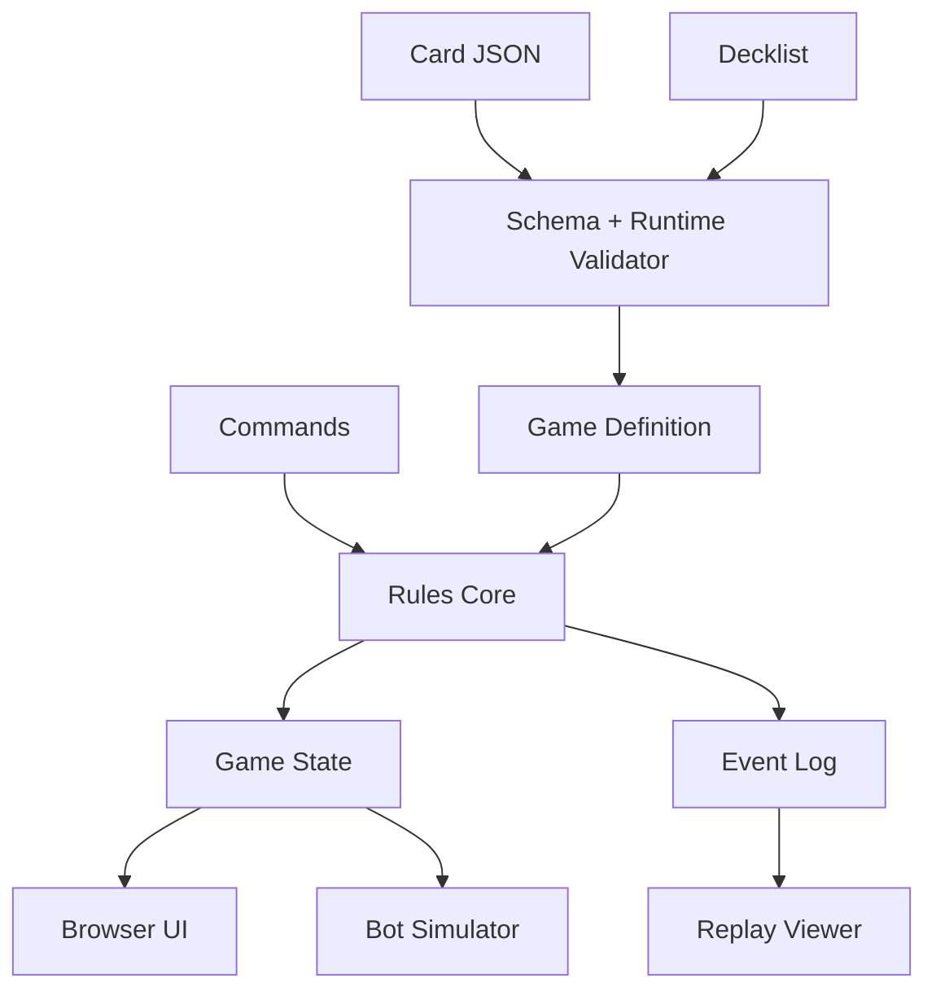

# OpenCards Architecture

## Layers

1. **Rules core**: deterministic state transitions, commands, events, RNG and replay.
2. **Card model**: cards, printed definitions, instances, zones, visibility and ownership.
3. **Effect engine**: small declarative operations that can be validated and replayed.
4. **Deck/scenario model**: decklists, formats, match setup and legality checks.
5. **Surfaces**: browser player, deck editor, card editor, simulator and replay viewer.



## Core State

The canonical state should include:

- players and life/base totals;
- resources for the turn;
- turn, phase and priority holder;
- card instances with stable ids;
- zones: deck, hand, discard, exile, battlefield, stack and custom zones;
- attachments and counters;
- RNG state;
- command log and event log.

## Command Examples

- `keepHand`
- `mulligan`
- `playCard`
- `activateAbility`
- `chooseTarget`
- `resolveStack`
- `attack`
- `block`
- `endPhase`

Every command must validate against state, active timing window, player priority, costs and target rules.

## Event Examples

- `cardDrawn`
- `cardMoved`
- `resourceSpent`
- `effectQueued`
- `effectResolved`
- `damageDealt`
- `unitSummoned`
- `phaseAdvanced`
- `gameEnded`

Events are the source for animations, replay, logs and analytics.

## Effect DSL

Start narrow. The first effect operations should be enough for Ember Duel:

- `gainResource`
- `drawCards`
- `dealDamage`
- `heal`
- `summonUnit`
- `moveCard`
- `addCounter`
- `modifyStatUntilEndOfTurn`

Do not build a universal rules language first. Add operations only when a real card needs them.

## Validation

Validation must happen in two layers:

- JSON Schema for file shape and editor import/export.
- Runtime validation for cross-field rules: unknown keywords, impossible costs, invalid target selectors, missing assets, illegal deck sizes and unsupported timing windows.

## Replay Contract

```text
card database hash + decklist hash + setup + seed + ordered commands = final state hash
```

If any card text changes, old replays should either verify against the old hash or clearly fail with a definition mismatch.
