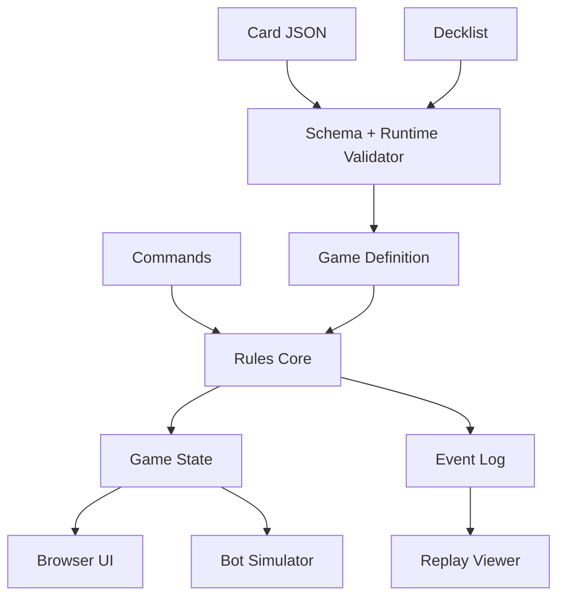

# OpenCards Architecture

## Current State

The MVP roadmap through Phase 8 is shipped. OpenCards now has deterministic
core setup, commands, replay verification, hidden-information-safe player
views, schema and runtime validation, a browser play/editor surface, simulator
fixtures, and the OpenBoard adapter documentation path.

`npm run verify:mvp` is the single confidence command. It runs the package
quality gate, schema/runtime validation, simulator checks, app build, and app
smoke verification. `npm run check` remains the inner package gate used by the
MVP verifier.

## Layers

1. **Rules core**: deterministic state transitions, commands, events, RNG and replay.
2. **Card model**: cards, printed definitions, instances, zones, visibility and ownership.
3. **Effect engine**: recursive trigger/condition/target/effect operations that can be validated and replayed.
4. **Game packages**: rulesets, cards, decklists, deterministic scenarios, and legality checks.
5. **Surfaces**: browser player, tutorials, deck/card/format editors, AI, simulator, and replay viewer.


```mermaid
flowchart TD
  A["Card JSON"] --> B["Schema + Runtime Validator"]
  C["Decklist"] --> B
  B --> D["Game Definition"]
  E["Commands"] --> F["Rules Core"]
  D --> F
  F --> G["Game State"]
  F --> H["Event Log"]
  G --> I["Browser UI"]
  G --> J["Bot Simulator"]
  H --> K["Replay Viewer"]
```

## Core State

The canonical state includes:

- players and life/base totals;
- resources for the turn;
- turn, phase and priority holder;
- card instances with stable ids;
- zones: deck, hand, discard, exile, battlefield and stack;
- counters and temporary stat modifiers;
- RNG state;
- card definitions indexed by kind.

## Commands

- drawCard
- playCard
- chooseTarget
- makeChoice
- resolveStack
- attack
- endPhase
- endTurn

Every command must validate against state, active timing window, player priority, costs and target rules.

## Events

- `cardDrawn`
- `cardMoved`
- `resourceSpent`
- `effectQueued`
- `effectResolved`
- `damageDealt`
- `healed`
- `counterAdded`
- `statModified`
- `unitDestroyed`
- `unitSummoned`
- `phaseAdvanced`
- `turnEnded`
- `gameEnded`

Events are the source for animations, replay, logs and analytics.

## Effect DSL

ADR-0002 records the original nine-operation slice. ADR-0009 and V1_OPERATIONS in packages/effects/src/index.ts define the shipped Foundry vocabulary: 21 recursive operations, eight triggers, conditions, statuses, attachments, secrets, deterministic random targets, and explicit choices.

New behavior remains generic and data-driven. A new operation requires schema, dispatcher, replay, projection, editor, and focused behavior coverage.

## Validation

Validation must happen in two layers:

- JSON Schema for file shape and editor import/export.
- Runtime validation for cross-field rules: unknown keywords, impossible costs, invalid target selectors, illegal deck sizes and unsupported timing windows.

## Replay Contract

OpenCards uses `ReplayEnvelopeV1`:

```ts
{
  schemaVersion: '0.1.0',
  seed: number,
  setupOpts: SetupOpts,
  commands: Command[],
  finalStateHash: string,
}
```

`setupOpts` carries the deterministic setup, including `cards: CardSpec[]` with
effects and optional `decklist`. Edited definitions ride in `setupOpts.cards`;
Phase 6 did not add a separate `cardDbHash`.

Hashes use canonical JSON with stable object-key order, stable array order, and
sha256 hex via `@noble/hashes`. Card instance ids created by setup use
`${player}-c${index}` with a zero-padded index, for example `p1-c00`.

If any card definition in `setupOpts.cards`, setup option, seed, or ordered
command changes, the replay must produce a different final state hash or fail
verification.

## Public Adapter Surface

OpenBoard and other adapters use only the root `@opencards/core` facade:

- `startMatch`
- `applyCommand`
- `viewMatch`
- `legalCommands`
- `replayEnvelope`
- `hashState`
- `canonicalJson`
- `CORE_VERSION`
- `seedRng`
- `nextRng`
- `nextRangeRng`
- `fisherYates`

Raw `State`, `apply`, `replay`, `computeReplayHash`, source module paths, and
the `@opencards/core/internal` subpath are not public adapter APIs.

ADR-0008 (`docs/adr/0008-openboard-integration.md`) and
`docs/openboard-adapter.md` define the Phase 8 integration path.
