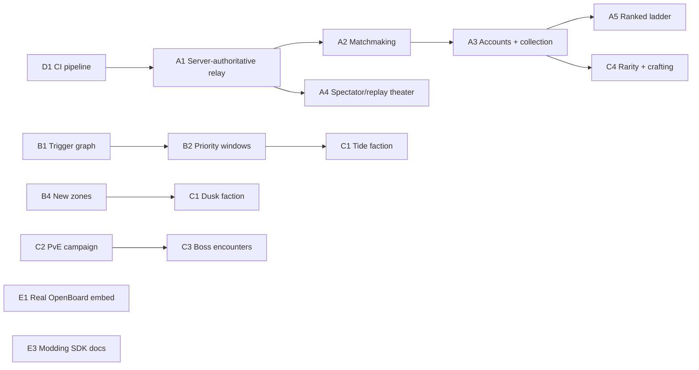

# OpenCards Foundry — Horizon 2 Roadmap (Ultra-Ambitious)

## Where we actually are

Phases -1 through 8 of the original roadmap are shipped and deployed (`docs/roadmap.md`, now historical). Concretely, as of this document:

- Deterministic engine: RNG, shuffle, hash, dispatcher, replay, `getLegalCommands`, hidden-info projection — all tested, `verify:mvp` green.
- Effect DSL with a public stack, target selectors, 8 keywords (guard/haste/rush/charge/shield/stealth/poisonous/lifesteal), triggered abilities (`onPlay`/`onDeath`/`onAttack`), configurable rulesets, scenarios.
- One reference game (Ember Foundry, ~35 cards across 3 factions) plus a second minimal game (Quick Sparks) proving the ruleset system isn't single-purpose.
- A heuristic bot (`packages/ai`) that plays only through `getLegalCommands` — structurally incapable of cheating.
- A React app: command-driven UI, targeting state machine, replay export/verify with a hash-match indicator, deck editor, card creator (form + raw JSON), guided tutorials, Playwright smoke coverage.
- Generated card art for all 35 Foundry cards, served as static WebP.
- Deployed to Vercel, single command (`npm run verify:mvp`) as the confidence gate.

**What does not exist yet, at all:** any server, any account system, any network protocol, any CI pipeline, any persistence beyond `localStorage`, any second reference deck beyond the two toy games, any accessibility audit, any mobile-specific layout testing, any load/perf testing, any external players who aren't the two people sharing one keyboard.

This is a complete, well-engineered **local hot-seat card game engine + one full game on top of it.** Horizon 2 is about what it takes to become something people other than us can install once and use forever — or play against each other from different rooms.

---

## Progress log (updated as horizons land)

- **D1 (CI pipeline) — done.** `.github/workflows/ci.yml`, Ubuntu + Windows matrix running `verify:mvp` on every push/PR.
- **Technical debt (`requiredTargetSelectors` dedupe) — done.** Single-sourced in `dispatcher.ts`, `legal.ts` imports it.
- **A1 (server-authoritative match relay) — done.** `packages/server`: `MatchRoom` wraps `@opencards/core`'s public facade directly (zero duplicated rules logic), WebSocket transport, hidden-info-safe per-viewer broadcast, `command.player !== sender` impersonation guard, deterministic match-code→seed hash. Verified live end-to-end (real WebSocket connections, not just unit tests).
- **A1 client (Online mode in the app) — done.** `OnlinePlay` component reuses `BoardView` as a controlled component, connects to `packages/server` over a real `WebSocket`. Verified live: two real browser tabs, real server, a command from one tab live-updated both boards with hidden information correctly enforced throughout.
- **A4 (spectator mode) — done.** `getSpectatorView` masks BOTH hands (every seat gets the same proven opponent-masking treatment via a shared `projectOpponent` helper); `MatchRoom` refactored to hold raw `State` via `@opencards/core/internal`; a dedicated read-only `SpectatorView` UI component. Verified live: 3 simultaneous real browser tabs (p1/p2/spectator) against one real server — the spectator never saw either hand.
- **A2/A3/A5 — deliberately paused.** "Private lobby via a shared code" (A2's main value) already exists as of A1. Quick-match pairing has little value with no real concurrent users yet. A3 (accounts + persistent collection) requires real infrastructure commitments — hosting, a database, an auth strategy, ongoing cost — that the user should decide on explicitly rather than the orchestrator picking a stack unilaterally. Not building until asked.
- **D3 (accessibility audit) — done.** `@axe-core/playwright` scanning 6 key screens; every real violation found was fixed in app code (contrast, ARIA, keyboard focus), zero rules silenced.
- **D2 (visual regression) — deliberately paused.** Pixel-diff screenshot testing is only trustworthy when baselines are generated in the SAME environment CI will compare against. This project's CI matrix runs both `ubuntu-latest` and `windows-latest`; this dev environment is Windows-only and its Docker daemon isn't running, so there is no clean way right now to generate Linux-consistent baselines (a Windows-rendered baseline would cause spurious CI failures on the Linux leg, or vice versa). Revisit when Docker Desktop is running locally, or by generating baselines from an actual CI run instead of locally.
- Everything else in this document is still ahead.

---

## Guiding principle (unchanged, now load-bearing)

> `card db hash + decklist hash + setup + seed + ordered commands = final state hash`

Every item below either (a) is a pure client-side improvement that doesn't touch this invariant, or (b) explicitly extends it (e.g. a server becomes a third-party _verifier_ of the same replay envelope, never a second source of truth). This is what makes online play, spectating, and anti-cheat nearly free once we do them — the hard part (determinism) is already paid for.

---

## Horizon A — Real Online Multiplayer

The single biggest capability gap. Everything else is additive; this is architectural.

### A1. Server-authoritative match relay

- A thin Node/Bun server holds canonical `State` per match (reusing `@opencards/core` directly — same package, zero duplicated rules logic).
- Clients send `Command`s over WebSocket; server calls the _exact same_ `apply()` used client-side, rejects anything not in `getLegalCommands`, broadcasts the resulting event delta.
- Because state and legality are already pure functions with zero I/O, this is a thin transport wrapper, not a rewrite. This is the payoff for Phase 1's determinism obsession.
- Client becomes optimistic-UI: apply locally for instant feedback, reconcile against server's authoritative event stream (same pattern as the existing replay-hash-match chip, just live instead of retrospective).

### A2. Matchmaking + lobbies

- Quick match (random opponent, same format), private lobby (share a code), rematch.
- Format/ruleset selection surfaced before match start (the engine already supports arbitrary rulesets — the lobby just needs to expose the picker).

### A3. Accounts + persistent collection

- Auth (email magic link or OAuth — avoid owning passwords).
- Server-side deck/collection storage replacing `localStorage` as the source of truth; local storage becomes a cache/offline fallback, not the record.
- Cross-device play: start a match on desktop, spectate on mobile.

### A4. Spectator mode + replay theater

- The replay envelope already round-trips through `verify:mvp`. A spectator is just a client subscribed to the same event stream with no command-send permission.
- A "replay theater" view: scrub through a finished match's event log (already partially modeled by the app's event-log UI), with play/pause/speed controls — this is small once A1 exists.

### A5. Ranked ladder + MMR

- Only meaningful after A1–A3. Elo/Glicko on top of match results already recorded via replay envelopes.

**Sequencing note:** A1 is the prerequisite for everything else in this horizon and is the single most valuable investment in the whole roadmap — it's also the one place where "ultra-ambitious" meets "actually tractable," because the domain logic reuse from `@opencards/core` is total.

---

## Horizon B — Engine Depth (the mechanics MTG/Hearthstone/Gwent players expect)

Deliberately deferred by the original roadmap ("Out of scope for v1... revisit only when a real card forces it"). A real card now would force several of these.

### B1. Full triggered-ability graph

- Current: `onPlay`/`onDeath`/`onAttack`. Missing: `onDamaged`, `onTurnStart`/`onTurnEnd`, `onDraw`, `onOtherUnitDies` (aristocrats-style), `onBlock`.
- Needs a proper trigger-registration + resolution-order model (SBA-style, like MTG's state-based actions) rather than ad hoc hooks in the dispatcher — this is the biggest single core-engine refactor on this list.

### B2. Priority / response windows

- Today the stack resolves top-to-bottom with no opportunity for the opponent to respond (no "counter this tactic" pattern). A real response window (pass/respond loop with priority) unlocks a whole design space (counterspells, combat tricks, instant-speed removal).
- This is the ADR-0002-deferred "revisit only when a real card forces it" item — Horizon C's counter-tactic archetype is that card.

### B3. Layered continuous effects

- Anthem effects ("your other units get +1/+1"), aura-style buffs that need to recompute live rather than apply once. Currently `modifyStatUntilEndOfTurn` is the only continuous-ish primitive.

### B4. Zones beyond battlefield/hand/deck/discard/exile/stack

- Secrets/traps zone (partially modeled via `setSecret` op already — formalize it), attachments/equipment zone (partially modeled via `attach` — formalize), graveyard-matters mechanics.

### B5. Full keyword pass

- Taunt variants (can't-be-targeted, must-be-blocked-first vs. Guard's current semantics), Divine Shield-style "prevent next damage instance," Windfury/extra-attacks, Overload/delayed-cost resources, Combo (bonus if you've played 2+ cards this turn — needs turn-scoped counters already partially present via `heat`/`ward` counters).

### B6. Draft / Arena format

- Pack-opening simulation + pick-a-card-from-3 draft flow reusing `validateDecklist` and the existing format system almost unchanged — mostly a UI + a random-pool generator.

---

## Horizon C — Content Breadth

### C1. A fourth and fifth faction

- Ember (fire aggro), Verdant (nature midrange), Clockwork (constructs/value) exist. Natural fourth: **Tide** (control/counters, unlocks Horizon B2's response windows) and **Dusk** (sacrifice/graveyard, unlocks B4's graveyard zone). Each faction should be chosen specifically to justify a deferred engine feature, not just for flavor — that's how the original roadmap avoided "a universal TCG rules language before Ember Duel proves the loop," and Horizon C should keep obeying that discipline.

### C2. PvE campaign

- A sequence of scripted opponent decks + AI difficulty curve, reusing `packages/ai` and the scenario system already built for tutorials. This is mostly content + a campaign-progress persistence model, not new engine work.

### C3. Boss encounters with unique rules

- The ruleset system (ADR-0009) already supports non-standard rules (different starting base, alternate win conditions). A boss fight with "you start with 10 base, opponent starts with 40 and heals 2/turn" is a ruleset, not an engine change — cheap ambition.

### C4. Legendary/rare card tier + a real collection/crafting loop

- Only worth building after Horizon A3 gives us persistent server-side collections to spend currency against. Purely additive to card-definition schema (a `rarity` field).

---

## Horizon D — Platform, Trust, and Ops

### D1. CI pipeline (currently: none)

- GitHub Actions running `npm run verify:mvp` on every PR — this is overdue independent of everything else here; right now green/red is only known by whoever runs it locally.
- Add: Windows + Linux matrix (the project already has ADR-0003 documenting a Windows-specific vitest workaround — CI should catch cross-platform drift before it becomes another workaround).

### D2. Visual regression testing

- Playwright already exists for functional smoke; add screenshot-diff coverage for the key states the original Phase 5 exit criteria named (setup, mid-game, win screen) so UI changes can't silently break layout.

### D3. Accessibility audit

- Phase 5 added an a11y smoke test (keyboard-reachable nav, named controls) — extend to full WCAG AA pass: color contrast on the dark theme, screen-reader labels on battlefield unit stats, focus management in the targeting state machine.

### D4. Mobile-first responsive pass

- Current layout is desktop-oriented. A card game is a natural mobile fit (touch-to-target maps cleanly onto the existing click-to-target model) — this is a real UX project, not a CSS tweak, given the fanned-hand and battlefield-grid layouts.

### D5. Performance/load testing

- Once Horizon A exists: concurrent-match load testing on the relay server, WebSocket connection scaling, client bundle-size budget (currently reasonable — keep it that way as art/content grows).

### D6. Observability

- Structured logging + error tracking (Sentry-class) once there's a server and real users; replay envelopes double as perfect bug-repro artifacts "for free" since the invariant already guarantees byte-identical reproduction from seed + commands.

---

## Horizon E — Ecosystem (the "ultra" part)

### E1. Ship the OpenBoard adapter for real

- Phase 8 wrote the ADR and the adapter _guide_ (`docs/openboard-adapter.md`) but never built an actual embedding. Horizon E1 is: build a minimal OpenBoard-hosted mini-game that imports `@opencards/core` live and proves the documented contract isn't aspirational.

### E2. Public deck-sharing + card-definition marketplace

- The editor-owned data contract (Phase 6) already means a card is just validated JSON. A "share this deck/card as a URL or code" feature is nearly free; a browsable community gallery is a bigger but natural next step once A3's accounts exist.

### E3. Modding API

- Formalize `@opencards/core`'s public facade (already stable-surface-tested per ADR-0008) as a documented SDK so a third party could build an entirely different game on the engine without forking it — Quick Sparks already proves this is _possible_; E3 is making it _documented and supported_.

### E4. Desktop/native wrapper

- Tauri or Electron wrapper once the web app is feature-complete, for offline play without a browser tab, plus native notifications for async multiplayer turns.

---

## Sequencing (what "ultra-ambitious but not reckless" looks like)

D1 (CI) is the cheapest, highest-leverage first move — it protects every other horizon from silent regressions. A1 (server relay) is the single highest-value item on the whole list: it's the one thing that turns this from "a very well-built solo/hot-seat toy" into "a game people can actually play against strangers," and the codebase's determinism-first design makes it dramatically cheaper than it would be for a typical card-game engine.

## Explicitly out of scope (until something concrete forces it)

Same discipline as the original roadmap's "Key Risks" section: no universal rules language, no speculative monetization system before there's an audience, no native mobile apps before the responsive web pass proves the layout works, no matchmaking algorithm sophistication before there are enough concurrent players for it to matter. Horizon E's marketplace/modding items are explicitly the _last_ things to build, not the first — content and multiplayer prove the loop before the ecosystem needs supporting.
